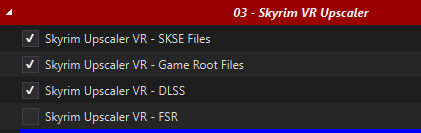
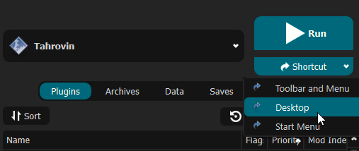

First things first: **this list contains adult content and you must be of legal age in your country. This means 18+ in most countries, 21+ in others. It is up to you to be sure of the age requirement in your country. Tahrovin is a collection of different mods from various sources, it does not reflect the views or opinions of any mod author's featured in the list.**

***Having issues with the modlist? [FAQ \& Common Issues](#faq--common-issues)***

Support and general talk about Tahrovin resides on the Jolly Co-operators Discord:

# What is Tahrovin Grit ?
Tahrovin Grit is a fork of Tahrovin, a NSFW Skyrim VR modlist. It retains some of the eye-candy its predecessor is known for, but opts for more grounded outfits and slightly less intrusive NSFW mods. It also features light survival gameplay and aims towards a slower-paced character growth, reworking many gameplay mechanics to provide a well-balanced challenge throughout your playthrough.

# Before You Start
Before you dive in, there's a couple things you need to be sure of first:

## Hardware Requirements
The following specs are recommended for the best experience:
  * CPU: Intel 7th gen *OR* AMD Ryzen 3000 series 
  * RAM: 16GB of DDR4
  * GPU: RTX 2060 *or the AMD equivalent with at least 6GB of VRAM*

You will need at least `189GB` of disk space on an SSD for the installation. For the downloads, you will need an extra `73GB`- ideally you want *at least* `270GB` for temporary Wabbajack work space. It doesn't have to be an NVMe SSD, but a HDD of any kind will make the list painfully unplayable. 

**If you are using a Quest 2, there are a couple of performance recommendations that you can [find here](Oculus%20Performance%20Tips.md) if you are struggling to get the game to run well.**

## Accounts
In terms of accounts you will need:
  * Nexus Premium Account
  * LoversLab Account
  * VectorPlexus Account

Whilst you don't *need* a Nexus premium account to install the modlist, you'll have a considerably better time of it if you do.

# Installation
Please follow all of steps below if it is your first time installing this modlist, if you're updating you can [jump straight there](#updating-tahrovin).

## Preparation

### Install Microsoft Visual C++ Redistributable Packages
This package is a must as it is needed by MO2 - you may already have it if you've used MO2 before. If you do not have it, you want to download the x64 version under "Visual Studio 2015, 2017 and 2019".

[Download Visual C++ Redistributable Package.](https://docs.microsoft.com/en-us/cpp/windows/latest-supported-vc-redist?view=msvc-170)

### Setup your Page File
Skyrim modlists need a large amount of memory purely because of the amount of *stuff* in them - especially modlists on the larger side or with a lot going on, like Tahrovin. For the best experience, you should setup a pagefile of at least **20GB** - yes, even if you have a million GB of RAM. To setup your pagfile;

1. Hold down the *LEFT* Windows key and press **R**
2. Type in `systempropertiesadvanced` in the run box and then press ENTER
3. Under the "Performance" option, click the "Settings..." button
4. Switch to the "Advanced" tab
5. Under "Virtual Memory", click the "Change..." button
6. Uncheck `Automatically manage...` if it's checked
7. Select your *fastest* SSD in the list of drives
8. Check "Custom Size"
9. Set `Initial Size` to 20480
10. Set `Maximum Size` to 20480 also
    1.  *Note: you can set this up to 40000 if you have the space, this will let the pagefile expand to as large as 40GB*
11. Press the "Set" button
12. Press OK
13. Press APPLY and then OK
14. Restart your PC to apply the pagefile setting

### Setup your Shader Cache
Driver defaults from NVidia and AMD for shader cache size is limited to 4GB. Being this small can lead to rare crashes in heavily modified Skyrim installs. Increasing the shader cache size is done via the NVidia Control Panel (I assume the same for AMD users is true also but I don't have AMD hardware to check with). 

*These instructions are NVidia specific as it is the hardware I have.*

1. Open the NVidia Control Panel
2. Head to `Manage 3D Settings`
3. Scroll down in `Global Settings` to find the `Shader Cache Size` option
4. Set the Shader Cache to *at least* 10GB
5. Done

### Configuring Steam
In both global and game settings within Steam and Oculus settings you must ensure the following is set:
  * Supersampling is *OFF*
  * Render Resolution to 100% (1.0 if you're looking at Oculus settings)

### Disable Steam Overlay
The Steam overlay is known to cause issues for both Skyrim VR and regular Skyrim SE/AE, especially when using ENBs. I recommend you turn it off to be sure that it doesn't interfere in any way and you can do so by heading into Steam, right
clicking on Skyrim VR in your game library and clicking **Properties** > **General** > **Deselect "Enable Steam Overlay while in-game"**.

### Set game language to English
Wabbajack and some/most of the modding tools out there only support English language versions of Skyrim. Setting the language to English in Steam will stop issues like Wabbajack file verification failures when installing. As with disabling the overlay, right click on Skyrim VR in your game library and click **Properties** > **Language** > **Select English**.

### Change Steam's Updating Behavior
If for some reason Bethesda decide to release an update for Skyrim VR, everything will probably break. Well, not *everything* but something will definitely break until mods can be updated to suit. To stop this from happening, you need to tell Steam that you only want to update when you tell it to. You can do this by right clicking on Skyrim VR in your game library and clicking **Properties** > **Updates** > **Change Automatic Updates to "Only update this game when I launch it"**. Whilst you're in here, it's also recommended to disable Steam Cloud too.

### Clean current Skyrim VR installation
If you have not yet installed Skyrim VR, you can skip this part.

1. Right click on Skyrim VR in your game library and click **Properties** > **Local Files** > **Browse**. 
2. Uninstall the game via Steam - right click on Skyrim VR in your game library and click **Manage** > **Uninstall**.
3. Check the explorer window for any left over files - if there are any, delete them.
4. Open Windows start menu/search and type in `%LOCALAPPDATA%`.
5. Delete the Skyrim VR folder.
6. Head to `Documents\My Games` and delete the Skyrim VR folder.

### Install Skyrim VR
Once you've done the steps above, you can now set Steam to download Skyrim VR again but ***do not*** install Skyrim VR to a protected folder, such as `Desktop`, `Downloads` or `Program Files` of any kind. It's best to create a new, dedicated folder for it using the Steam Library function somewhere on the root of your drive such as `C:\SteamLibrary`. A lot of people have a dedicated secondary drive for their games, keeping the OS install separate; using this secondary drive will also work.

### Start Skyrim VR
That's right - start the game. You need to let the game do its initial start up jobs such as creating registry entries and generating default config files. Once you've gotten to the main menu you can close the game again.

## Wabbajack
Installing the list is straight forward, Wabbajack will do most of the heavy lifting for you - you only have to tell it where to put stuff. Grab the Tahrovin from the Wabbajack UI, once its downloaded the initial stuff it needs, Wabbajack will have 2 things for you to do - fill in the installation location and the download location. 

Set the installation location to a folder on the root of a drive, something like `C:\Tahrovin`. Do not install it to one of the protected folders as mentioned earlier. The download location will have likely been filled in for you too - ensure it matches the directory you set for the installation location, or if you have multiple Skyrim VR modlists installed, use a common download folder - this will stop you from having to redownload common mods across multiple modlists. 

Before you hit **GO**, a quick tip:

*To get the best performance with Wabbajack, it is recommended that you have the install folder for Wabbajack, the modlist folder and the downloads folder on an SSD; ideally the same SSD.* After the installation is complete, you can move the downloads folder to a storage HDD or other storage medium to save space on your game installation drive. It's not recommended to allow your drive to exceed 90% of its storage space used - Windows Explorer will show a red bar under your drive if you do go over 90% so you need to be sure that you have enough space on your installation drive so that you won't exceed this 90% storage level.

Once you have everything set in Wabbajack, hit **GO** and let it do its thing. It might take a while as there is a fair bit to download and the speed of this will depend on your internet performance as well as your CPU in the later stages for hashing and unpacking the downloads.

## Commonly Failing Downloads
Downloads from file hosts such as Google Drive and Mega can sometimes be a pain and refuse to download automatically via Wabbajack for reasons unknown. Any files that might give you trouble [can be found here for manual download](https://github.com/iAmMe27/Tahrovin/wiki/Commonly-Failing-Downloads).

Download these files and place them *as they are* into the same folder you told Wabbajack to put your downloads in. Let me reiterate just to be sure - **do not unzip the archives!**

## Troubleshooting
If you're having issues with installation, check the [troubleshooting page](Troubleshooting.md). 

# Post-Installation
Almost there but we're not out of the woods yet! After Wabbajack has given you the installation successful screen, you're free to close it. Navigate to the Tahrovin installation folder and run MO2 by double-clicking `ModOrganizer.exe`.

***DO NOT UNDER ANY CIRCUMSTANCES RUN LOOT. The load order is exactly as intended out of the box and you do not need to change it.***

## Stock Game
Tahrovin utilises the stock game feature offered by Wabbajack, meaning that Wabbajack will make a local copy of your Skyrim VR game files during the installation process. This means that your Steam installation of Skyrim VR is completely untouched, even by files that go in the game folder such as ENB files.

## Community Shaders
As a note the first time Community Shaders runs it will have to compile shaders, this may take a while and may look like SkyrimVR is frozen, just be patient. This process will also most likely be repeated any time you change mods in the list.
The Community Shaders Menu can be opened with END and from here you can toggle individual shaders on and off.

## Skyrim VR Upscaler Selection
Like in the previous section, Skyrim VR Upscaler options are found in MO2 under the `Skyrim VR Upscaler` separator. 

Remember, AMD and non-RTX GPU's must use **FSR** and not DLSS or DLAA.

## Creating a desktop shortcut
Nobody wants to be launching their game via multiple clicks, they want to be able to do it from the desktop! This is simple to do - open MO2, ensure **Tahrovin** is selected in the dropdown and click the "Shortcut" button. From the small dropdown menu, click "Desktop". Of course, you can always run from inside of MO2 by clicking the "Run" button instead.

Done! You should now have a shortcut on your desktop which you can now run the modlist from. Don't run Skyrim VR from within Steam as it won't launch MO2's virtual file system to make a modded game instance.

## Swapping between SteamVR and OpenComposite Binaries
See Oculus performance tips
[Oculus Performance Tips](Oculus%20Performance%20Tips.md)

# Pre-Game Launch

**Before launching the game, make sure your VR headset is initialised and both controllers are connected. Launching the game, without both of these conditions met will be a bad time.**

## DLSS/FSR/XeSS

Refer to the [Skyrim VR Upscaler](#skyrim-vr-upscaler-selection) section.

## Optional mods

Before starting, you can make choices in the Optional sections of the list, colored in Orange in MO2. Pick a set of controller bindings, a defeat mod, a Vampire Lord body mod depending on your character's gender, and any of the other optional mods that interest you. Make sure to do so **before you start a new game** as changing your mods mid-save can be a bad idea : 

- Quickloot VR : Adds a looting menu similar to the one present in FO4
- Smalls : Adds underwear to bodies when you loot them, doesn't work well with Quickloot.
- Shadow of Skyrim - SL on defeat : Defeat system. Starts a sexlab scene whenever you are defeated by an enemy. It is integrated into the Shadow of Skyrim Nemesis system, but there's no configuration available to customize it.
- Yamete Redux : Alternative defeat system. It will require manual MCM configuration and is known to be finnicky.
- CBPC VRSex - Sexlab Solutions Override : Will use the CBPC VRSex instead of Sexlab to handle any sex interactions started by the Sexlab Solutions mod between the player and a female NPC, as long as the player is not in a victim context.
- Dragonborn speaks naturally : Grants the ability to use voice commands to do things such as equip spells and items, shout, or select dialogue options. Requires Windows speech recognition.
-  Occlusion FPS Boost : Should give you an FPS boost when outside, at the cost of some rare flickering in specific places (detected on some setups in the Windhelm bridge and on the College's bridge)
-  Daedric Bitchs : Optional followers 
-  Additemmenu : Lets you add items as you wish

# Mod Setup

### *THIS STEP IS IMPORTANT! IF YOU DO NOT DO THIS STEP, YOUR GAME WILL NOT FUNCTION CORRECTLY!*

When starting a new game, create your character and once done, *DO NOTHING ELSE* and allow the mods to initialise. Once the notifications stop appearing in the top left of your view, you should calibrate VRIK by using the `VRIK Calibration Power` located in your powers menu. Do this while standing on a flat surface in game. Follow the instructions in the VRIK pop-up dialog to ensure you get this right, otherwise you might find yourself towering over everyone else or way too short. Don't worry about making it absolutely perfect, you can recalibrate at any time. After you've calibrated VRIK, head to the Mod Configuration Menu to start the mod setup.

The MCM setup is *mostly* automated and will run on its own after you've finished character creation. As mentioned, *DO NOTHING* until the window pops-up telling you to save.

When you are done, save your game, go back to the main menu, then load that save so the last few mods can load properly.

That done, there are optional configuration changes you may wish to make in the Mod Configuration Menu :

- The Better Resources Warning mod will alert you if your stats (Health, Magicka, Stamina) are low by giving the screen a shade of red, blue, or black and white. You can activate one or all of them as you wish. For example, to activate the Health warning go to Better Resources Warning > Health Options and set Max Modifier Magnitude on the top-right to 0.5

- The CBPC VRSex mod will create basic sex interactions with female NPCs without taking control of the player, but requires the player to have a penis. If you wish to use it but are playing a female character, the mod can let your character grow a penis temporarily during VRSex scenes. Go to CBPC VRsex and check the "Auto-futa" option. Don't check the option if you are playing a male character, or a female character that is already permanently futa.

- Creature animations may play if you selected a defeat mod among the optional NSFW mods, or if you use the Sexlab Enchantress spells. If you would like to disable them, go to Sexlab > Animation Settings > Allow Creature Animation.

## Controller Bindings
[Controller bindings can be found here](ControllerBindings.md)

## Essential VR mod tutorials
If this is your first time playing Skyrim VR, you may want to watch these tutorial videos to understand how some of the essential mods function.
- https://youtu.be/CEi7gwN8hgg
- https://youtu.be/Nd9A-_G2eXU

## Starting out
When you first start a new game, you won't find yourself inside of Skyrim anywhere. Instead, you will be inside of the Realm of Lorkhan. This mod replaces the vanilla Skyrim intro, which is known to be extremely buggy, especially in VR. 

*I'm sure you've seen the vanilla intro already, right?* 

The Realm of Lorkhan mod allows you to craft your character. You may pick a shrine and standing stone bonus to start with. Make sure to speak with Sera the Trainer to increase your starting skills as you wish. If you don't get a training dialog when talking to her, make sure you followed my earlier instructions by **saving your game, going back to the main menu then reloading.**

The training system offered by Sera the Trainer is available throughout all of Skyrim. Most NPCs will offer you training in a few skills they are skilled in. To train, you will need gold and Training Points (TP) which you will gain at each level up. This is the main way to increase your skills, as regular skill leveling has been drastically slowed down. You can check your available TP at any time through the Training Potential power. The gold required to train will change depending on factors such as your skill level, your trainer's skill level and your relationship with the trainer (friends charge less).

Sera the Trainer charges less gold for her training than most other trainers in Skyrim. Don't skip out on the opportunity to raise some of your skills here, but consider keeping at least a little bit of gold for later.

Once you teleport at one of the crystals, you'll be dumped into Skyrim in the place you chose. Make your choices wisely though - once you leave, you cannot return.

## CBPC VRSex
[CBPC VRSex](https://www.loverslab.com/files/file/29662-cbpc-vrsex/) is a mod to create basic sex interactions without taking control away from the player. It requires the player to have a penis. If you are playing a non-futa female, you may use the "Auto-futa" option in the MCM to temporarily grow a penis during VRSex scenes. 

If you wish to use that system, read the manual in your inventory or on the stand next to the "VRSex Training Dummy" NPC in the Realm of Lorkhan. Feel free to try out the mod on that Training Dummy to figure out how things work.

To start, I recommend activating the Incubus Arts power then groping the VRSex dummy until she collapses. You can either keep groping her while she's collapsed, or use the Molag Bal's Compulsion spell to force her to take a pose. There are only two poses at the moment, chosen at random. Just cast Molag Bal's Compulsion spell again to switch. Either way, if you keep groping her, your character should strip and get an erection. The mod will then detect collision between penis and vagina, so set yourself in the right position and start having sex. After a little while, you will receive bonuses depending on the level of your partner. If your partner is lower level than you are, this will likely only be a temporary stat boost, but a higher level partner may grant you a permanent point of health or magicka. Details on these bonuses are described in the VRSex Manual.

You can technically also use the Knockout Arts power instead of Incubus Arts, but a starting character will find it extremely hard to use. The knockout combo will only activate if you have 90 stamina. As parrying uses up your stamina, you will often find yourself parrying an enemy attack and ruining the combo. Before you start using Knockout Arts instead of Incubus Arts, either increase your warrior skills to learn Improved Knockout Arts or increase your stamina.

The third option, Molag Bal's Subjugation, is easier to use than both Incubus Arts and Knockout Arts but is entirely unavailable as a starting character and requires investing into Illusion.

## Playing a mage
Being able to use magic is not a given in Tahrovin Grit and will require an investment. Your magicka regeneration in combat is faster, but your starting magicka is only 50 and you do not start with any spells (other than the various debug spells) unless you are one of the races granted a bonus spell (Breton, Dunmer, Altmer). Furthermore, you will find that spell books are prohibitively expensive for a starting character. You will still find spell books in the world as usual, but it may be tempting to sell them instead of learning the spell they contain.

Rather than spell books, your main way to acquire new spells will be through Spell Forging. To do so, you must first read the [Spellforge](https://www.nexusmods.com/skyrimspecialedition/mods/46482) book in your inventory. Let the spell library initialize, it will then display a menu. Pick the "Conjure Forge" option to learn the spell and close the menu.

If you want to start the game as a mage right away, I recommend doing the following : 
- Increase your magicka by picking the Mage, Lady or Atronach standing stones, otherwise you'll lack the magicka to even forge novice spells at first. As a more temporary measure, Julianos' shrine can also help. Note that Altmer already start with an extra 50 magicka and may not necessarily need to do that.
- Increase one of your racial magic skills to at least 20 at Sera the Trainer if possible. You should have enough gold and TP to raise a skill from 10 to 20 right away. This will allow you to learn a novice spell through Spellforge immediately. If you don't have any racial magic skills or you'd rather use a different skill but still want a spell right away, you'll have to skip the rest of this process and instead save your gold to buy a spell book at a merchant.

Cast the "Conjure Spellforge" spell on the ground to summon the forge and select the bottom node to access the forge's main functions. Select the Resin Experimentation option.

For every level you reach above 15 in a magic skill, you will receive School Theses upon using the Resin Experimentation option. Later, you will also be able to use this menu to create Arcane Resin by incinerating alchemy ingredients in the forge. If you've raised a magic skill to 20 earlier, you should immediately receive 10 school theses here.

Exit the spellforge menu, use the middle node in the forge and select the school you have trained in.

Once set, use the bottom node again and select Spell Forging > Synthesize spell selection. This will grant you a selection of all spells that match your specifications - here you should see all available Novice spells from your selected school, but later you can use the middle and top nodes in the forge to restrict that list further. Select a spell and exit the menu.

You will automatically equip an "enkindle" ability that you can channel to drain your magicka to power the forge. If you have enough magicka (60 for a novice spell) and channeled the enkindle ability to completion, the forging process is finished and you will receive the spell. Don't worry, if you fail you can retrieve your school theses and resin by interacting with the forge (nothing is lost).

As you play, keep raising your magic skills to gain more school theses and learn more spells. You can also create Arcane Resin by experimenting with ingredients in the spellforge, which will work the same as School Theses but allow you to learn spells from any school. Read the spellforge mod description (https://www.nexusmods.com/skyrimspecialedition/mods/46482) for more details. Creating Arcane Resin through Spellforge usually requires powerful ingredients such as Nirnroot. However, some recipes work with large quantities of mundane ingredients (such as 10 units of Bone Meals). If you try to experiment with the wrong quantities, you will still learn the recipe for later, with the exact quantity needed. If you have a decently valuable alchemy ingredient, try to throw it in the Spellforge and see what happens !

Other changes compared to base Tahrovin : 
- Triumvirate has been removed
- [Balance adjustments for Apocalypse](https://www.nexusmods.com/skyrimspecialedition/mods/104987) deals with the worst offenders, such as turning Ocato's Recital into a series of perks or switching Ghostwalk from a novice to an expert spell.
- Two Darenii spell packs have been added, [Abyss](https://www.nexusmods.com/skyrimspecialedition/mods/83329) and [Arcane](https://www.nexusmods.com/skyrimspecialedition/mods/91602).
- [Thaumaturgy](https://www.nexusmods.com/skyrimspecialedition/mods/57138) rebalances enchanted items
- [Sexlab Enchantress](https://www.loverslab.com/files/file/9712-sexlab-enchantress-se) provides sexlab-related versions of the basic illusion spells. These spells do not replace the actual basic illusion spells here, there will usually be a regular version and an erotic version of the spell that can be learned separately.  
- The [Spellsiphon](https://www.nexusmods.com/skyrimspecialedition/mods/26627) magic system is available, but not immediately. To unlock the Spellsiphon Urn in your inventory, you will need at least 20 Restoration and either 20 Destruction or 20 Conjuration.
- Various other small additions : [Immersive Bend Will](https://www.nexusmods.com/skyrimspecialedition/mods/62233), [Perception](https://www.nexusmods.com/skyrimspecialedition/mods/7559), [NPCs react to Necromancy](https://www.nexusmods.com/skyrimspecialedition/mods/70428)[/Invisibility](https://www.nexusmods.com/skyrimspecialedition/mods/91480).

## Playing a warrior
The main change you will notice as a warrior is that vanilla blocking has been removed entirely in favor of [Pseudo Physical Weapon Collision and Parry](https://www.nexusmods.com/skyrimspecialedition/mods/100781). To block with a shield, you no longer simply have to hold the shield in front of you. You must intercept the enemy's attack with it, while holding the trigger button on the hand holding the shield. If you have a timed-block perk, you can trigger it by pressing the trigger to block at the moment of impact. Weapons no longer block at all, they can only use the Pseudo-physical parry system by intercepting the enemy's attack. By moving the weapon or shield fast enough as you parry or block, you may even stagger the enemy. Both blocking and parrying will cost Stamina instead of Health. If you are out of Stamina, weapon parrying becomes impossible and shield blocking starts to use Health instead.

You will also be able to block and parry arrows and spell projectiles by intercepting them physically. While holding trigger, projectiles will be slowed at the cost of a bit of magicka, making that process easier.

The settings for pseudo-physical parry are less forgiving than the ones in base Tahrovin. You will not be able to parry by simply standing still, make sure to move your weapon as you intercept.

Just like in Base Tahrovin, [Weapon Throw VR](https://www.nexusmods.com/skyrimspecialedition/mods/31374) will allow you to use your melee weapons as throwing weapons. However, the stamina costs have been increased compared to base Tahrovin, and the stagger effects reduced. A battle-axe throw may stagger an enemy but will cost a lot of stamina, while a dagger throw is relatively cheap but not as effective.

[Durability VR](https://www.nexusmods.com/skyrimspecialedition/mods/76830) makes weapons and armor slowly degrade as you use them. This is a slow process, but using the same equipment for a very long time without maintaining it will eventually break it. To keep the equipment in good condition, you will have to temper it. The better-tempered the equipment, the slower the degradation. Magic weapons and artifacts also degrade more slowly. At first, you will likely not be able to temper your equipment (see [Crafting and Economy](#crafting-and-economy)) but you will still be able to repair your equipment through [Immersive Smithing](https://www.nexusmods.com/skyrimspecialedition/mods/72298). Go to a forge and equip the Blacksmith Hammer in your inventory. The ingame tutorial should guide you through the process. Careful however, not even Immersive Smithing will be able to repair enchanted equipment without the appropriate smithing perks !

Finally, you will no longer be able to do power attacks unless you are able to pay the full stamina cost.

## Playing a thief
There's not a lot of changes on that end. Pickpocketing and lockpicking are harder than usual if you're unskilled, but easier if you do raise your skills. [Broken picks](https://www.nexusmods.com/skyrimspecialedition/mods/95275) makes it so breaking your lockpick will throw you out of the lockpicking minigame and force you to start from scratch - make sure to check for patrolling guards ! Otherwise, it's just the usual [Vokriinator](https://www.nexusmods.com/skyrimspecialedition/mods/26702) stuff, same as base Tahrovin.

## Leveling
Instead of increasing your level by raising your skills, the [Experience](https://www.nexusmods.com/skyrimspecialedition/mods/17751) mod lets you increase your level as you adventure, exploring Skyrim and accomplishing quests. The leveling curve has been modified to provide a slower-paced experience.

Levels and skills have not been decoupled however. As explained earlier, you will be able to train your skills as you wish each level thanks to [Trainers Galore](https://www.nexusmods.com/skyrimspecialedition/mods/20360) and its [Training Points](https://www.nexusmods.com/skyrimspecialedition/mods/103092) addon. Almost every NPC can now train you in a few skills as long as you have the gold and the Training Points. Skyrim's regular skill leveling is not gone, but is now much slower. Your skills start at 5. You may be able to progress through the lower levels of skill entirely on your own, but you will have a hard time going further without seeking training.

## Crafting and Economy
You may notice that the only crafting workstation you are able to use from the start is the Tanning Rack. Otherwise, you will need to increase your skills first. Smithing workstations require a smithing skill of 15. Alchemy and Enchanting workstations require their skill at 20.

Until you learn to craft for yourself, smiths and enchanters of skyrim can do the work for you thanks to Honed Metal. Tempering services are the cheapest ones, crafting services are in the middle, and enchanting services are fairly expensive. Prices will of course depend on the equipment being tempered/crafted, but also on the artisan - the more skilled they are, the more gold they'll ask for.

[Trade and Barter](https://www.nexusmods.com/skyrimspecialedition/mods/23081) alters the prices at which items are bought and sold, making it more difficult to make money through trade and making the various gold sinks (training, equipment maintenance, defeat...) more meaningful.

If you're short on gold and lacking leads on how to make more, [Missives](https://www.nexusmods.com/skyrimspecialedition/mods/17576) quests can help you get back on track. Simply check the quest bulletin board that can be found in any major city. If a missive board doesn't give you a list of quests immediately on your first activation, wait a few moments and try again.

## Survival and needs
Tahrovin Grit uses [Sunhelm](https://www.nexusmods.com/skyrimspecialedition/mods/39414) and a stripped-down version of [Campsite](https://www.nexusmods.com/skyrimspecialedition/mods/22353) for its Survival elements. Eat, drink and sleep regularly to keep yourself in top condition, and avoid staying out in the cold too long without adequate protection. 
Buy or craft a tent at a tanning rack to sleep out in the wild - but be wary of night ambushes from [Sands of Time Sleeping Encounters](https://www.nexusmods.com/skyrimspecialedition/mods/8257) !

If you have enough firewood in your inventory, you can use it to create campfires and warm yourself up. By setting a tent near trees, you may turn it into a Wood-chopping tent and get some more firewood for your campfire, but make sure you have a Woodcutter's axe to chop the wood !

Fast travel is disabled, but there are now more carriage routes available thanks to [Carriage and Ferry Travel Overhaul](https://www.nexusmods.com/skyrimspecialedition/mods/8379). Consider buying a horse when able, but take care not to get them killed. A horse will also be useful to carry more things : Thanks to [Gift by Hand VR](https://www.nexusmods.com/skyrimspecialedition/mods/99809) you can access your horse's inventory by triple-grasping them (grasping them three times in quick succession). You can also call your horse at any time by putting both hands to your mouth and holding the triggers for more than 1 second.

## Enemies and encounters
Encounter zones have been slightly increased, and new enemies have been added with [Hand-Placed Enemies](https://www.nexusmods.com/skyrimspecialedition/mods/59249). [Locational Encounter Zones](https://www.nexusmods.com/skyrimspecialedition/mods/85212) ensures that even in the overworld, enemies will match the level of their encounter zone.
New random overworld encounters have been added through [Extended Encounters](https://www.nexusmods.com/skyrimspecialedition/mods/44810).

[Dragon Combat Overhaul](https://www.nexusmods.com/skyrimspecialedition/mods/56082) makes dragons smarter and grants them powerful new abilities. Their attacks are also generally stronger, and they have extra resistance to attacks that do not come directly from you.

## Death
[Shadow of Skyrim](https://www.nexusmods.com/skyrimspecialedition/mods/65136) means death is not the end. Upon defeat, you will generally be assaulted by the victor in a Sexlab Scene. In most cases they will become your Nemesis and grow in power. If they're not a creature, they will also take some of your equipment to use for themselves. Meanwhile, you will receive a penalty : either (100*your level) in gold, or a dragon soul if you don't have the gold, or a permanent point of health if you don't have the soul either (note that you will be able to regain permanent health points through CBPC VRSex). You will also receive a situational or random debuff.

It's not all bad however - going back and defeating your Nemesis will not only grant you some experience, but it will also transform that debuff into a related permanent buff, up to a total maximum of 5 buffs and debuffs from this mod.

## Followers
When a follower falls in combat, they will not get back up by themselves until the combat is over. If you want them back in the fight, you can heal them with healing spells, or with a potion.
To feed a potion to a follower, simply put it in your hand with Spellwheel, put it in your follower's mouth and let it drop.

Most followers will require a weekly amount of 300 gold to sustain themselves. Special followers that are not handled by [Nether's Follower Framework](https://www.nexusmods.com/skyrimspecialedition/mods/55653) (Lucien, Inigo, Auri, Serana...) will not require this.

## Quests
The encounter zones for the main quest, starting from Bleak Falls Barrow, have been increased. I would not recommend trying to get through it at level 1. The reason for this is that going through the main quest would unlock dragons, and you do *not* want to fight a dragon at level 1 in this list. On the other hand, who knows - if you can manage to get through Bleak Falls Barrow even at a low level, maybe you'll be able to handle yourself against a dragon just fine.

Delaying the main quest doesn't mean Alduin will stay put forever. After 90 days, if you haven't finished the main quest, Alduin will come seeking to destroy you. This will be an easier fight than the actual, full-powered Alduin you will have to fight in the main quest, but you should still make sure you have grown strong enough to fend him off. Once you do, you will have 20 more days before he seeks you out again. Take care and don't slack off on your training : every time he comes back, Alduin will be even more powerful !

Otherwise, no new quests have been added compared to regular Tahrovin, but many of [jayserpa's vanilla quest expansions](https://www.nexusmods.com/skyrimspecialedition/users/5201727) have been integrated.

## Other changes
- [Mundus](https://www.nexusmods.com/skyrimspecialedition/mods/33411) is the standing stone overhaul
- [Aetherius](https://www.nexusmods.com/skyrimspecialedition/mods/26686) is the race overhaul 
- [Quickloot VR](https://www.nexusmods.com/skyrimspecialedition/mods/102094) reduces the amount of menus
- [Reading is good](https://www.nexusmods.com/skyrimspecialedition/mods/42026) means you no longer need to hold on to these skill books forever
- [Voiced books of skyrim](https://www.nexusmods.com/skyrimspecialedition/mods/94436) means you can pop an audiobook while traveling.
- [Potion Toxicity](https://www.nexusmods.com/skyrimspecialedition/mods/32576) prevents you from overusing a bunch of potions in the middle of a fight, as they will grow less and less effective.
- [Onyx Weathers](https://www.nexusmods.com/skyrimspecialedition/mods/36227) replaces the weather mod, with much brighter nights. If that's not enough, I've added a lantern from Eld-beri II to your inventory.

## Gameplay advice
The recommended difficulty for this list is Adept. The mods will provide plenty of difficulty on their own. If you still want to alter the difficulty, consider using the Simply Balanced MCM.

When training, be on the lookout for experience modifiers. For example, having read skill books will grant you experience modifiers that make your training more effective. However, training while exhausted will make your training less effective. If you are careless, you might not get a full skill level out of it.

Before you attempt to take down a dragon, make sure you have a good ranged attack. Even if you can survive a dragon in close quarters, they will not simply stand by while you hack at them.

You can open a container normally instead of using Quickloot by keeping the interact button pressed for a second or two.

CBPC VRSex grants a number of bonuses if you have sex with a higher level character than you, including a permanent point of health or magicka. If you spot a strong enemy and you're not in refractory cooldown, try to take her down nonlethally if you can !

When trading, consider which merchants to buy from and sell to.
- Specialists (blacksmiths, alchemists, court mages) will have better prices than generalist shops.
- Merchants will offer you discounts if you belong to the same guild, and further discounts if you are guild leader.
- In big cities like Windhelm or Solitude, you will sell for more but also have to buy for more. The reverse is true in small towns like Riverwood.
- You will have better prices with merchants of the same race, while merchants of hostile races (such as an argonian and a dunmer, or an altmer and a stormcloak nord) will have worse prices.
- You will have better prices if the merchant is on friendly terms with you, which can usually be accomplished by completing a task for them. This will also override the "racism" factor entirely.

# FAQ & Common Issues

## My game won't start even after a fresh install!
Check in your `Tahrovin\Stock Game` folder for an `openvr_api.dll` file. If this file is not present, your game cannot start. To solve this, copy the `openvr_api.dll` file from your Skyrim VR Steam installation folder into your `Tahrovin\Stock Game` folder and relaunch.

When using ENB Organizer, **always** disable an option *then* enable another. Not doing this will mess up the files.

## I get an OpenComposite error when launching the game?
Like this?

If you are getting an error message like the screenshot when launching the game, you have OpenComposite enabled for a non-Oculus headset or you are using VirtualDesktop. Disable OpenComposite, enable SteamVR.

## I Crashed!
Giving me that little info is not helpful. 

Make sure you excluded your Tahrovin folder in your antivirus software. If you use an aggressive antivirus package such as Webroot, Bitdefender, Avast etc etc, I urge you to get rid of it and just use Windows Defender.

Please upload (drag and drop the file into the `#tahrovin-support` Discord channel) the most recent crash log from your `Documents\My Games\Skyrim VR\SKSE` folder.

If you have modified Tahrovin, ignore the previous advice and keep to the `#tahrovin-modifications` Discord channel. I will not help you with modified lists in official support categories - less because I don't want to and more because I cannot.

## Where's my UI?
Raise your left hand, palm facing upwards, to activate the compass and your stat bars. Raise your right hand in the same way for your needs bars. If you wish, equip the soul gauges in your inventory and assign them to stats. When it asks for hand offset, I recommend you set the offset to **3**.

## Is there a way for me to see myself?
Raise your right hand above your head and rotate your wrist to turn your character. If you put your right hand down, your character should stay in selfie mode - re-raise your right hand to disable.

## How do I change my or an NPC's body?
Autobody. Default VRIK gesture is Right Thumbstick click + Controller Down. Want to change the Autobody gesture? [Read this.](https://github.com/iAmMe27/Tahrovin/wiki/Changing-Autobody-Hotkey)

## Playing in Seated Mode
Tahrovin features the `Auto Sneak and Jump` mod which relies on your movement in real life to jump and crouch, therefore making it not very useful to you if you prefer to play in seated mode. Unless you'd like to try sneaking everywhere you go, you should be fine to disable this mod from the "Gameplay Mods" section in MO2.

## My performance is really bad!
Your CPU or GPU is too weak. Or, you don't have XMP enabled for your RAM.

If you ignored the minimum specifications I wrote near the top of this readme, that's on you.

## Loading takes too long!
Shouldn't have put the modlist on a HDD - I did warn you earlier in this very readme.

## I have grey hands/Vive wands in game!
Create a new file in the Stock Game folder and name it `opencomposite.ini`. In that file, write a single line consisting of:

`admitUnknownProps=true`

Save, close, relaunch game.

## I can't move!
You started Tahrovin before making sure your controllers were connected. Restart the game.

## I CTD on launch!
Well, that could be a multitude of things. Make sure you Tahrovin folder is added to your antivirus exceptions/allow list and try again.

If you have some heavily aggressive antivirus program such as Webroot, Bitdefender etc, get rid of it.

If you have a non-RTX Nvidia GPU, I ask you to refer to the [DLSS/FSR/XeSS](#dlssfsrxess) section again.

## Can I add XYZ?
I don't know, can you?

# Updating Tahrovin
When an update is released, please always check the [changelog](Changelog.md) first. You may not need to update your modlist but if there is anything that resolves game breaking issues, it'll be noted in the changelog. Backup your saves before you commit to any updates, Wabbajack doesn't usually touch save files, it does has the ability to delete them if it wanted to.

If you have added anything to this modlist at all, Wabbajack will also delete those. You should know how to stop it from doing this if you're going to add stuff to modlists but if you don't, you have to prepend your mod name with `[NoDelete]` - this will make Wabbajack ignore these files. You will need to reinstall these mods and re-sort their load order after an update though, so I hope you kept backup information on where they went in the load order!

All that aside, updates are basically the same as an installation except you have to ensure that you have the "Overwrite" checkbox ticked in Wabbajack.

# Uninstalling Tahrovin
No fancy uninstallation needed, you can just delete the Tahrovin folder and it'll be gone. There'll be no files left inside your Steam installation folder because Tahrovin uses the stock game feature of Wabbajack.

# Thank You's
Many thanks to the Wabbajack team for making this possible at all, to iAmMe for making the original Tahrovin, and to Neochiken for continuing it.
